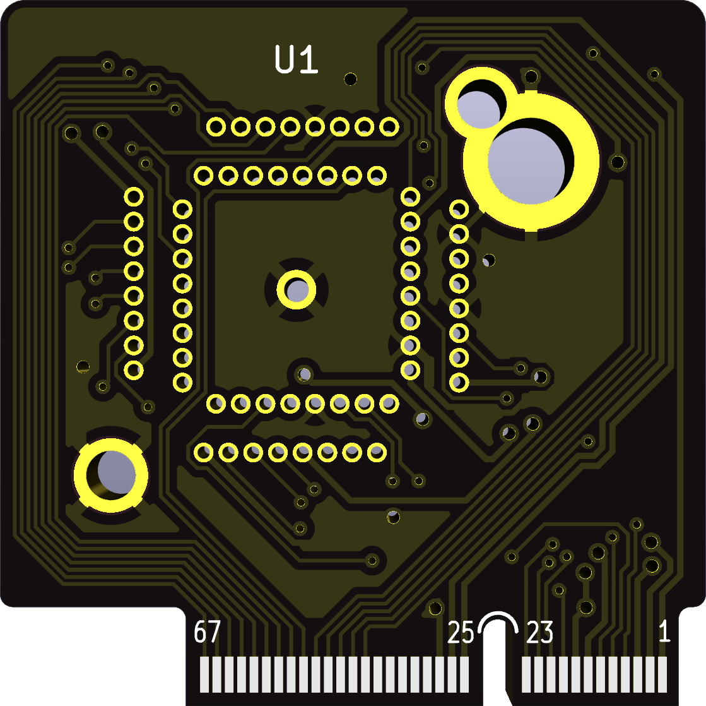

# Caravel M.2 to QFN64 socket adapter

Allows testing of unsoldered Caravel chips with the
[official Caravel evaluation board](https://github.com/efabless/caravel_board/tree/main/hardware/development/caravel-dev-v5-M.2)
or other compatible boards such as the [M.2 E-key breakout](https://github.com/htfab/m2e-breakout).

Drop-in replacement for the 
[Caravel M.2 daughtercard](https://github.com/efabless/caravel_board/tree/main/hardware/breakout/caravel-M.2-card-QFN).

